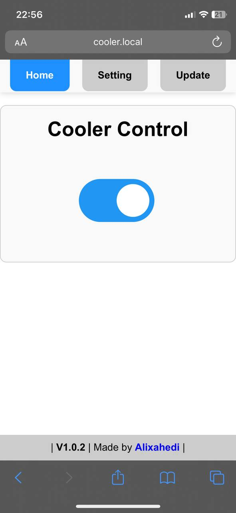
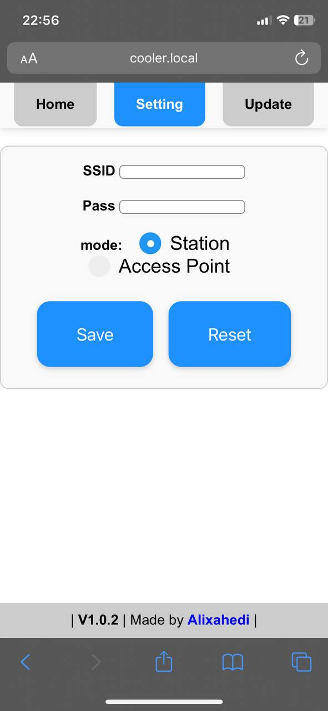
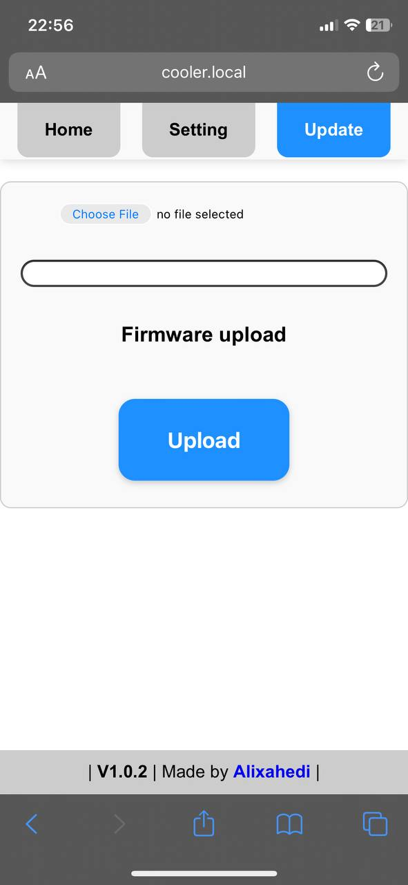

# Esp8266_Wifi_Controller

This project enables you to **control the power of an electrical device** like the evaporative cooler I use for it!
This project uses a web page to control the device. Like me, you can add this web page as a web application to your mobile software. Then, by clicking on the icon of this program, enter the web page of this device and control the desired device.
This project works in 2 working modes.

 

- Access point (a WiFi that you can connect to)
- Station (if there is another WAFA in the place, connect the device to it)

 

The selection of the working mode of this project is available in the settings tab. (Photo no. 2) At first, after the program, the module will try to connect to a Wi-Fi, but because the SSID and Wi-Fi password have not yet been defined for the module, the attempt will be unsuccessful. And after 10 seconds, the module will create an access point named Cooler (if you use this project for another device, you can select the device name, web page title, and host address at the beginning of the Wifi_Controller.ino file). Also, this project has the ability to program through the web page in the update tab (OTA). Select the Export Compiled Binary option from the Sketch menu of the Arduino IDE software to create a binary file. Then upload it on the web page update page, then select the upload option. After the program is received by the module, it will be programmed and the module will be restarted.
 
 
 

 
 

 
 

 
 
 

**Follow me on other platforms:**

 
 

